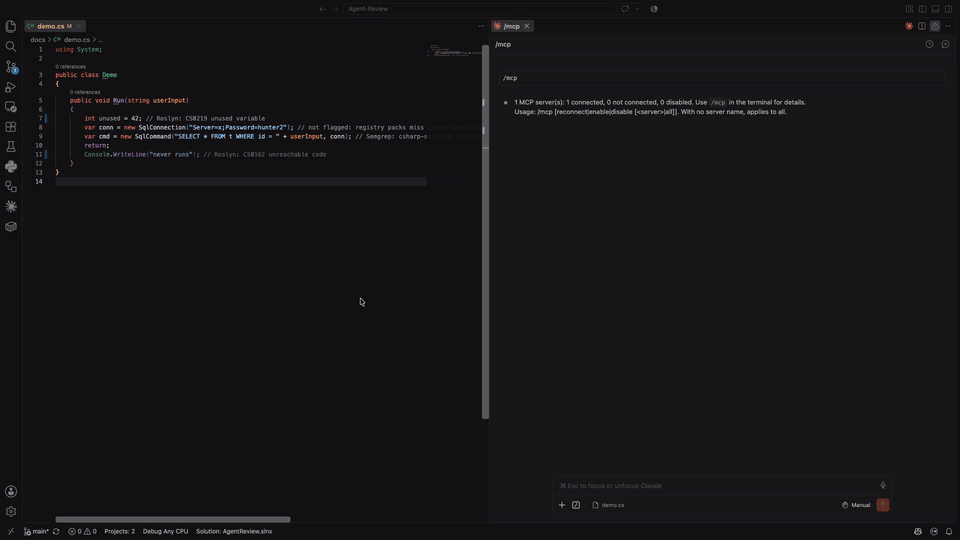

# AgentReview — Multi-Agent Code Review in C#/.NET with MCP

[](https://dotnet.microsoft.com/)
[](https://learn.microsoft.com/dotnet/csharp/)
[](https://modelcontextprotocol.io/)
[](LICENSE)
[](#build-plan)

A multi-agent system where specialized AI agents collaborate to review pull requests. An orchestrator routes a code diff to independent agents (one for code quality, one for security, one for documentation), then synthesizes their findings into a single ranked review. Agents reach real tools (Roslyn analyzers, Semgrep, the GitHub API) through the Model Context Protocol.

Built in C#/.NET. That choice is the point: agentic tooling is overwhelmingly Python, and this project proves the same patterns work in the Microsoft ecosystem. It is the sibling of [DocQuery](https://github.com/vondraysanford/docquery), which made the same argument for RAG.

> **✅ Status: Phase 4 complete.** The orchestrator fans one diff out to three agents concurrently and synthesizes their findings into a single ranked review: arbiter-clustered dedupe, stated survivor rules, exact provenance. Committed sample reviews (per-agent and synthesized) are the proof. Phases 5 and 6 below (evals, API) are still the build plan.

**The checkboxes in this README are an honesty contract. No box gets checked until the feature works end-to-end, verified in a terminal or a running app.**

## Demo

One diff in, one ranked review out: the orchestrator fans a planted diff out to the quality, security, and docs agents concurrently (33 seconds of agent work in 14.4s of wall clock in this run), then synthesis dedupes overlapping findings and ranks the rest, keeping exact provenance on every line.


The Phase 1 foundation, still demoable on its own: Claude Code calling the static-analysis MCP server's tools live, `analyze_csharp` (Roslyn) catching the planted unused variable and unreachable code, `run_semgrep` catching the planted SQL injection.



## Why This Project

Single-prompt LLM calls are a solved problem. The harder skill is getting multiple agents to coordinate reliably: routing work, calling real tools, and reconciling conflicting outputs. This project demonstrates that skill, and it turns an MCP certification into a working artifact instead of a resume line.

It also has a professional anchor: I built AI-driven pull-request and change-request automation used daily by a division at my current employer. AgentReview is the public, from-scratch version of that idea.

## What It Does (when complete)

- Accepts a GitHub pull request URL or a raw diff.
- Dispatches the diff to three specialized agents running concurrently:
  - **Quality Agent** — flags complexity, naming, duplication, and maintainability issues.
  - **Security Agent** — checks for injection risks, secret leakage, unsafe dependencies, and auth mistakes.
  - **Docs Agent** — identifies missing or outdated documentation and drafts updates.
- Each agent reaches real tools via MCP: a custom static-analysis MCP server (Roslyn + Semgrep) and the GitHub MCP server for surrounding file context.
- An orchestrator deduplicates findings, resolves conflicts, ranks by severity, and emits one consolidated review.
- Full observability: every agent's decisions, tool calls, latency, and token usage are traced.

## Tech Stack

**Agent Orchestration**
- C#/.NET 10 — plain orchestration first (concurrent fan-out, keyed DI for agent registration), the same pattern that powers DocQuery's provider routing. A framework (Semantic Kernel / Microsoft agent tooling) gets adopted only if it earns its place.
- Swappable LLM providers behind one interface, reusing the DocQuery pattern: Azure OpenAI and/or Anthropic API, with local Ollama as a dev option. Nothing network-related hardcoded.

**Tool Integration (MCP)**
- Official MCP C# SDK — building the custom server and the agent-side clients.
- **Static-analysis MCP server (custom, the centerpiece)** — wraps Roslyn analyzers for C# diffs and Semgrep for polyglot security rules, exposed as MCP tools.
- GitHub MCP server (existing) — repository and PR context beyond the changed lines.

**Observability**
- OpenTelemetry — first-class in .NET, per-agent traces of decisions, tool calls, latency, tokens.
- Structured JSON logging so every run is queryable.

**Serving**
- ASP.NET Core minimal API — a `/review` endpoint taking a PR URL or raw diff.
- Docker Compose — orchestrator plus MCP servers as one stack.
- React + Vite dashboard (optional, last).

## Architecture

```
                       PR URL / diff
                            │
                            ▼
                     ┌─────────────┐
                     │ Orchestrator│  (C# fan-out + synthesis)
                     └──────┬──────┘
            ┌───────────────┼────────────────┐
            ▼               ▼                ▼
      Quality Agent   Security Agent     Docs Agent
            │               │                │
            ▼               ▼                ▼
        MCP tools       MCP tools        MCP tools
    (Roslyn, GitHub) (Semgrep, Roslyn)   (GitHub)
            └───────────────┼────────────────┘
                            ▼
                  Synthesis + ranking
                            │
                            ▼
                  Consolidated review  ──►  API response / dashboard
```

## Build Plan

Phases are sized for weekends. One checklist item at a time; small, explainable commits.

### Phase 1 — Static-Analysis MCP Server (the MCP-first phase)

The first artifact is a working MCP server, not an agent. A server drops into Claude Code on day one and is demoable by itself; a tool-less agent is just a prompt.

- [x] `AgentReview.McpServers.StaticAnalysis` project: MCP server via the official C# SDK (verified 2026-08-02: answers `initialize` over stdio, connects in Claude Code via `.mcp.json`, zero tools yet)
- [x] `analyze_csharp(code)` tool backed by Roslyn analyzers, returning structured findings (verified 2026-08-03 in Claude Code: compiler diagnostics and NetAnalyzers CA rules, planted issues return CS0219, CS0162, and CA2000 with positions)
- [x] `run_semgrep(code, ruleset)` tool for polyglot security rules (verified 2026-08-04 in Claude Code: planted SQL injection returns csharp-sqli with position; ruleset defaults to p/default)
- [x] Verified end-to-end inside Claude Code: tools listed, calls succeed, findings come back structured (both tools called live in Claude Code sessions, 2026-08-03 and 2026-08-04; every invocation logged to stderr with size, finding count, and duration)
- [x] Demo GIF of Claude Code using the server (verified 2026-08-04: `docs/demo.gif`, recorded live in VS Code, shows both tools called via MCP with structured findings coming back; embedded above)

### Phase 2 — One Agent, Real Tools

- [x] Shared finding schema as a C# record (issue, file, line, severity, suggestion, source); every agent returns this shape, locked early (verified 2026-08-06: `Finding` record + ordered `FindingSeverity` enum in `AgentReview.Agents`, camelCase wire shape and analyzer severity mapping pinned by 4 new tests, 16 total green. This line originally omitted `source`; BUILD-GUIDE's six-field spec won because synthesis needs provenance)
- [x] Quality Agent: takes a diff, calls the static-analysis MCP tools, returns schema-valid findings grounded in analyzer output (verified 2026-08-06: sample diff through the Orchestrator runner produced 6 findings, Roslyn CS0219/CS0162/CA1822/CA1303 at real new-file line numbers plus LLM naming and readability findings; 4 LLM duplicates of analyzer lines deduped; logs show the `analyze_csharp` MCP call and LLM token usage, 1108 in / 944 out on the configured model; 35 unit tests green. Known v1 limitation: without repo coordinates the analyzer runs on hunk text; with `--repo` the GitHub MCP item below supplies full-file context. Single-file analysis still cannot resolve cross-file types, so CS resolution errors stay filtered in both modes)
- [x] GitHub MCP server wired in for surrounding file context (verified 2026-08-06: reviewed a real commit's diff with `--repo vondraysanford/Agent-Review`; logs show `get_file_contents` fetching the full 2004-char file through GitHub's hosted MCP server, the analyzer running in full-file mode at real line numbers, and the file appended to the LLM prompt as context, 2922 tokens in / 1407 out. Hosted-server note: sessions must pin the repo via `Mcp-Param-owner`/`Mcp-Param-repo` headers, so the client caches one connection per repo. Context failures degrade to fragment analysis instead of failing the review; raw-diff reviews without `--repo` are unchanged. 40 unit tests green)
- [x] Test harness with 2 or 3 controlled sample diffs; every tool call logged (verified 2026-08-06: `--harness` mode runs the real agent over 3 committed sample diffs, asserts schema validity in code, and writes the reviews to `samples/reviews/` as committed artifacts; all 3 pass with every MCP and LLM call logged. The clean diff yields 0 findings, proving the empty path; the modified-method diff shows the fragment limitation honestly, its analyzer findings anchor to context lines and the review is LLM-only. 42 unit tests green, including a no-network test pinning the committed reviews' schema)

### Phase 3 — The Other Two Agents

- [x] Security Agent (Semgrep-backed, plus LLM reasoning over the diff) (verified 2026-08-07: `--agent security` on a planted-vulnerability diff; Semgrep caught the SQL injection via `run_semgrep` with `p/csharp`, the LLM caught the hardcoded connection-string password that registry packs miss, and its duplicate SQLi restatement was deduped in favor of the scanner. Shared pipeline extracted to `DiffReviewAgentBase`; all 42 prior tests passed unchanged through the refactor, 47 total green)
- [x] Docs Agent (GitHub-context-backed) (verified 2026-08-07: `--agent docs` on a planted diff caught the undocumented public class and method and the stale comment claiming a null return where the code throws, drafting complete XML doc comments in the suggestions. LLM-only by design, no static tool pass; GitHub context widened to Markdown files via the base class's new file filters. 52 unit tests green, including a guard that quality's context stays C#-only)
- [x] All three run independently and return the identical schema (verified 2026-08-07: harness run per agent over all 5 sample diffs produced 15 committed schema-valid reviews under `samples/reviews/<agent>/`; lane separation is visible in the data, security returns zero findings on every non-security diff and exactly its planted catches on the security one. Schema identity pinned by a test asserting all three agents' findings serialize to the same six-field JSON shape, plus keyed-DI resolution of the full roster. 55 unit tests green)

### Phase 4 — Orchestration and Synthesis

- [x] Orchestrator fans one diff out to all three agents concurrently (verified 2026-08-07: `--all` on the security sample ran quality, security, and docs simultaneously; 31.0s of summed agent time completed in 13.7s of wall clock, with both MCP tools multiplexing concurrently over the single stdio server connection. A failing agent is captured in its result slot without sinking the run, pinned by tests including a deadlock-gate concurrency test. 59 unit tests green)
- [x] Synthesis: deduplicate overlapping findings, resolve conflicts with a stated rule or an LLM arbiter, rank by severity (verified 2026-08-07: hybrid design, an LLM arbiter clusters same-line findings that restate one issue but never rewrites them, then stated rules pick survivors: tool-backed beats LLM, then higher severity, then security > quality > docs; survivor keeps the cluster's max severity. Live `--all` runs merged the quality-LLM SQL-concatenation duplicate into Semgrep's SQLi finding (`kept semgrep, dropped quality-llm` in the logs) while distinct same-line findings survived. LLM sources are stamped with their agent (`quality-llm`, `docs-llm`) in the synthesized review so provenance stays exact. Arbiter failure degrades to an unmerged review, never an altered one. 67 unit tests green)
- [x] End-to-end test on a diff with planted issues produces one coherent, ordered review (verified 2026-08-07: deterministic pipeline test runs the full DI stack over scripted fakes and asserts the exact seven-row ranked review, Errors first, every provenance lane agent-stamped; the scripted LLM routes on the real system prompts so prompt rewrites fail loudly. Live: `e2e-demo.diff` plants issues for all three domains and its synthesized review carries all five sources (roslyn, semgrep, quality/security/docs-llm) in one severity-ordered list; `--harness --all` commits synthesized reviews for all 6 samples with an ordering check. 69 unit tests green)

### Phase 5 — Observability and Evals

- [x] OpenTelemetry tracing: per-agent decisions, tool calls, latency, token usage (verified 2026-08-07: `Telemetry__Enabled=true` on an `--all` run exports the full span tree via the console exporter: `review.fanout` with agents.succeeded, three overlapping `agent.review` spans, `tool.analyze_csharp`/`tool.run_semgrep`, per-call `llm.complete` with input/output token tags, and `synthesis` with duplicates.merged. Instrumentation is in-box ActivitySource in the library, zero new dependencies there; only the Orchestrator host takes OpenTelemetry.Extensions.Hosting + Exporter.Console 1.17.0, off by default so demo output stays clean. 72 unit tests green including listener-based span assertions)
- [x] Run summary per review: total latency, total tokens, tool-call success rate, cost (verified 2026-08-07: every `--all` run ends with the aggregated line, e.g. `summary: 15.5s fan-out, 4 LLM call(s) (4668 in / 2023 out tokens), 2/2 tool call(s) ok, ~$0.074 at configured rates`. Numbers aggregate in-process from the same OpenTelemetry span tags the exporter consumes, keyed by trace id; token counts are measured, cost is measured tokens times the configured per-MTok rates and labeled as such. 76 unit tests green)
- [x] Eval harness: seeded PRs with planted bugs; report per-agent precision and agreement with a human review (verified 2026-08-07: 8 seeded cases with 18 labeled planted issues in `evals/cases/`; `--eval` ran the full pipeline over all of them for $0.54 total, finding 15/18 planted issues (strict exact-line matching, misses reported honestly: one docs gap, one mixed-case issue, one multi-file doc mismatch). Machine-computable recall lands in `evals/results/machine.json`; the 45 unmatched findings await agree/disagree verdicts in `worksheet.json`, because precision needs a human, and `--eval --score` then computes final per-agent precision and the agreement rate without further LLM spend. The per-review budget guardrail also landed: worst-case cost ~$1.04 is computed from the caps before any spend and a run over budget refuses to start, proven live with a $0.01 budget. 83 unit tests green)
- [ ] Results table in this README filled with measured numbers

### Phase 6 — API and Ship

- [ ] ASP.NET Core `/review` endpoint (PR URL or raw diff)
- [ ] `docker compose up` brings up orchestrator and MCP servers together
- [ ] Sample reviews committed to the repo; demo GIF in this README
- [ ] Optional React dashboard rendering the review and the per-agent trace

## Results To Report (measured, not estimated)

| Metric | Value |
|---|---|
| Agreement rate vs. human review on a labeled PR set | _pending_ |
| Per-agent precision on planted bugs | _pending_ |
| End-to-end review latency | _pending_ |
| Tokens and cost per review | _pending_ |
| MCP tool-call success rate | _pending_ |

## Demo Decision (made up front)

There is no public review endpoint in v1, deliberately. A public API that runs three LLM agents against arbitrary PRs is a cost and abuse magnet. The public proof is: the demo GIF, committed sample reviews, and the eval numbers above. A likely later step: a GitHub Action that runs AgentReview on this repository's own pull requests, which is a live demo with a naturally bounded cost.

## Cost Guardrails

Token caps per agent enforced in code, a per-review budget the orchestrator refuses to exceed, and cost per review reported in the results table. Cloud spend gets a stated budget with alerts before Phase 2 begins, the same discipline that kept DocQuery's four phases near one dollar.

## Repository Layout (target)

```
agent-review/
├── src/
│   ├── AgentReview.Orchestrator/        # fan-out, synthesis, ranking
│   ├── AgentReview.Agents/              # quality, security, docs agents + shared schema
│   ├── AgentReview.McpServers.StaticAnalysis/  # Roslyn + Semgrep MCP server
│   └── AgentReview.Api/                 # ASP.NET Core /review endpoint
├── tests/
│   └── AgentReview.Tests/               # schema, synthesis, and harness tests
├── evals/                               # seeded PRs, labels, scoring scripts
├── dashboard/                           # React review viewer (optional, last)
├── docker-compose.yml
├── docs/
└── README.md
```

## License

MIT
